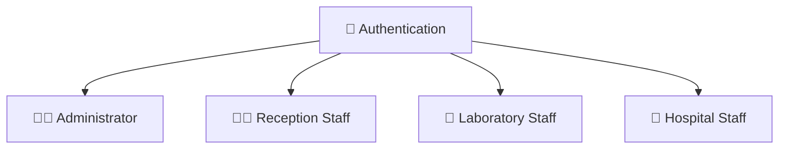
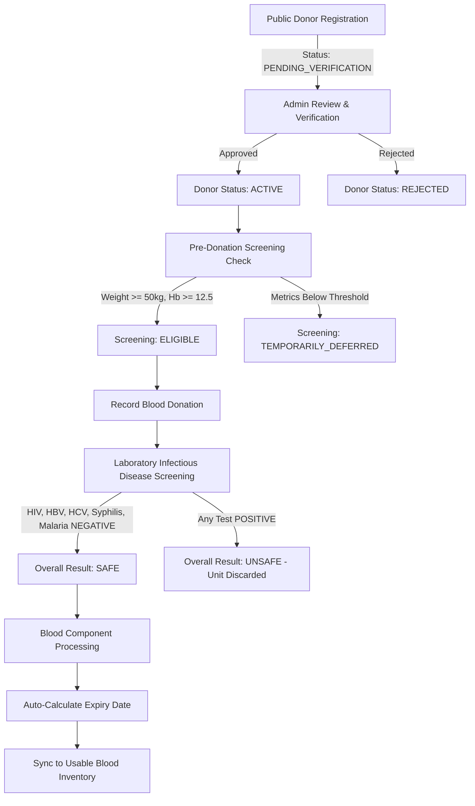
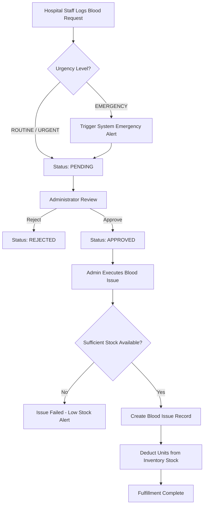
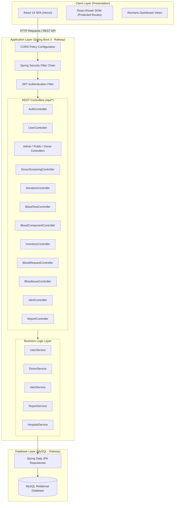

# 🩸 Blood Banking Management System

[](https://github.com/cepdnaclk/e23-co2060-Blood-Banking-Management-System)
[](https://github.com/cepdnaclk/e23-co2060-Blood-Banking-Management-System)
[](https://react.dev)
[](https://spring.io/projects/spring-boot)
[](https://www.mysql.com)
[](https://jwt.io)

> A full-stack, enterprise-grade web application developed to digitize, streamline, and audit blood bank operations—including donor registration, pre-donation screening, blood collection, laboratory infectious disease testing, blood component separation, shelf-life inventory tracking, hospital blood requests, and issuing processes.

<p align="center">
  <a href="https://github.com/cepdnaclk/e23-co2060-Blood-Banking-Management-System/issues">🐛 Report Bug</a>
  ·
  <a href="https://github.com/cepdnaclk/e23-co2060-Blood-Banking-Management-System/issues">✨ Request Feature</a>
  ·
  <a href="https://github.com/cepdnaclk/e23-co2060-Blood-Banking-Management-System">📖 Documentation</a>
</p>

<p align="center">
  <a href="https://github.com/Akshi2618">👩‍💻 Akshi2618</a>
</p>

## 📖 About the Project
The Blood Bank Management System (BBMS) is an integrated, multi-role web platform designed to automate and modernise the end-to-end operational lifecycle of a regional blood bank. Traditional blood bank systems heavily rely on manual logbooks, paper screening forms, and fragmented records, leading to potential data inaccuracies, untracked inventory expiration, and delayed responses during medical emergencies.

BBMS addresses these critical operational bottlenecks by implementing a centralized, data-driven management system. Built with a high-performance Java 21 / Spring Boot 3 REST API backend and a responsive React 19 single-page frontend, BBMS guarantees data integrity, operational traceability, automated stock allocation, and real-time alert dispatch for critical blood stock levels and pending hospital requests.

## 🎯 Project Objectives

- **Digitize Donor Management:** Maintain comprehensive profiles, medical history, screening results, and donation histories for all registered donors.
Enforce Safety & Compliance: Require mandatory laboratory testing for five major infectious diseases (HIV, Hepatitis B, Hepatitis C, Syphilis, and Malaria) before any collected blood is marked SAFE and allocated to usable inventory.

- **Automate Component Processing & Expiry Tracking:** Automatically derive component-specific shelf life (RBC: 42 days, Plasma: 365 days, Platelets: 5 days, Cryoprecipitate: 365 days, Whole Blood: 35 days) and calculate stock updates upon processing.
  
- **Optimize Hospital Blood Request Workflows:** Provide hospital staff with a direct portal to log blood requests, tag emergency requests to trigger immediate system-wide alerts, and track fulfillment status.
  
- **Ensure Stock & Transactional Traceability:** Maintain an immutable audit trail mapping every issued unit back through component processing, laboratory verification, donation collection, and pre-screening to the original donor.
  
- **Role-Based Operational Access:** Enforce strict permission boundaries across system administrators, receptionists, laboratory technicians, and hospital representatives using JSON Web Tokens (JWT) and Spring Security RBAC.

 ## ✨ Key Features & Functionalities

| **Feature** | **Description** |
| :--- | :--- |
| **Donor Management** | Public self-registration, administrator verification and approval workflow, donor profile management, eligibility date calculations, and status tracking (`PENDING_VERIFICATION`, `ACTIVE`, `REJECTED`). |
| **Donor Screening** | Pre-donation health assessment including weight, hemoglobin, blood pressure, temperature, pulse rate, and medical history, with automated eligibility evaluation (`ELIGIBLE`, `TEMPORARILY_DEFERRED`). |
| **Donation Recording** | Links completed blood collections with screened donors, validates minimum donation volume, and prevents duplicate donation records for a single screening. |
| **Laboratory Screening** | Records laboratory test results for HIV, HBV, HCV, Syphilis, and Malaria. The system automatically determines the overall safety status (`SAFE`, `UNSAFE`, `PENDING`). |
| **Blood Component Separation** | Processes safe blood into Red Blood Cells (RBC), Plasma, Platelets, Cryoprecipitate, or Whole Blood, with automated expiry-date calculation and inventory synchronization. |
| **Inventory Management** | Provides real-time blood stock tracking by blood group and component type, monitors stock levels, and generates alerts for low-stock and near-expiry units. |
| **Hospital Management** | Supports hospital registration, profile and contact management, and mapping of hospital staff user accounts to their respective hospitals. |
| **Blood Request Workflow** | Enables hospital staff to submit routine and emergency blood requests, with administrative review, approval, and priority management. |
| **Blood Issue & Stock Deduction** | Matches approved hospital requests with available blood stock, automatically deducts issued units from inventory, and maintains issue records and receipts. |
| **Alerts & Notifications** | Generates dynamic notifications for emergency blood requests, low-stock conditions, and approaching blood-unit expiry dates. |
| **Reports & Dashboards** | Provides interactive dashboards and analytical reports using Recharts, including inventory distribution by blood group, donor status distributions, and aggregated operational statistics. |
| **Audit Logging** | Maintains administrative logs of system activities, record modifications, and user actions to support accountability, traceability, and regulatory requirements. |


## 👥 User Roles

The system implements strict **Role-Based Access Control (RBAC)** via **Spring Security** annotations and React route guards (`ProtectedRoute`). Each authenticated user is granted access according to their assigned role.

### 🔐 Authentication & Role Structure



| **Role** | **Main Responsibilities & System Permissions** |
| :--- | :--- |
| 🛡️ **Administrator** (`ADMIN`) | Full administrative privileges across all system modules. Manages system users, registers hospitals, approves or rejects public donor registrations, approves or rejects hospital blood requests, executes blood issues, manages alerts, accesses audit logs, and views system reports. |
| 🧑‍💼 **Reception Staff** (`RECEPTION_STAFF`) | Registers new donors, manages donor records, reviews pending registrations, performs pre-screening checks, records blood donations, monitors blood inventory, and accesses operational alerts and reports. |
| 🧪 **Laboratory Staff** (`LAB_STAFF`) | Performs pre-donation screening evaluations and laboratory testing for infectious diseases, processes blood into components such as RBC, Plasma, Platelets, Cryoprecipitate, and Whole Blood, monitors inventory, and reviews blood requests and reports. |
| 🏥 **Hospital Staff** (`HOSPITAL_STAFF`) | Views hospital information, submits routine and emergency blood requests, tracks request approval and issuance status, checks real-time blood inventory availability, and views relevant alerts. |
| 🌐 **Public Access** *(Unauthenticated)* | Allows prospective donors to register online through `/register` and check their registration verification status using NIC or email through `/status`. |

## 🧩 System Modules

The Blood Bank Management System is composed of integrated modules that support the complete blood bank workflow, from secure authentication and donor registration to blood screening, component processing, inventory management, hospital requests, blood issuance, analytics, and auditing.

### 1. Authentication & User Management

- **Security:** JWT token-based authentication is implemented through `POST /api/auth/login`.
- **User Management:** Administrators can create, update, deactivate, and delete user accounts through the admin-protected `/api/users` endpoint.
- **Role Assignment:** User accounts can be assigned the following roles: `ADMIN`, `RECEPTION_STAFF`, `LAB_STAFF`, and `HOSPITAL_STAFF`.

### 2. Donor Management

- **Public Portal:** Prospective donors can register through `POST /api/public/donors` and check their registration status through `GET /api/public/donors/status/{nic}`.
- **Administrative Approval:** Administrators can review pending registrations through `/api/admin/donors/pending` and approve (`ACTIVE`) or reject (`REJECTED`) prospective donors, with rejection reasons recorded where applicable.
- **Donor Directory:** Authorized staff can list, search, and manage registered donor records through `/api/donor-management`.

### 3. Donor Screening

- **Pre-Donation Screening:** Screening records are managed through `/api/screenings` based on predefined physical eligibility criteria:
  - **Weight:** Must be `≥ 50 kg`
  - **Hemoglobin:** Must be `≥ 12.5 g/dL`
  - **Temperature:** Must be `< 37.5 °C`
  - **Pulse Rate:** Must be `≤ 100 bpm`
- **Automatic Eligibility Assessment:** Based on the screening criteria, the system automatically assigns either `ELIGIBLE` or `TEMPORARILY_DEFERRED`.

### 4. Donation Management

- **Donation Recording:** Blood collection records are created through `POST /api/donations/{donorId}/{screeningId}`.
- **Validation:** The system verifies that the donor is `ACTIVE` and that the associated screening status is `ELIGIBLE`.
- **Duplicate Prevention:** The system prevents duplicate donation records for the same screening event.

### 5. Laboratory Testing

- **Laboratory Test Entry:** Blood test results are recorded through `/api/blood-tests` for five mandatory disease panels:
  - HIV
  - Hepatitis B
  - Hepatitis C
  - Malaria
  - Syphilis
- **Automated Safety Assessment:** The overall blood safety status is calculated according to the following rules:
  - If **any** test result is `POSITIVE` → Overall result = `UNSAFE`
  - If no test is positive but **any** test result is `PENDING` → Overall result = `PENDING`
  - If **all** test results are `NEGATIVE` → Overall result = `SAFE`

### 6. Blood Component Processing & Inventory Synchronization

- **Component Creation:** Blood components are created through `/api/components` and are restricted to donations with a verified `SAFE` blood test result.
- **Automatic Shelf-Life Calculation:** The system calculates component expiration dates based on the collection date.

| **Blood Component** | **Shelf Life** |
| :--- | :--- |
| `RBC` (Red Blood Cells) | Collection Date + 42 Days |
| `PLASMA` | Collection Date + 365 Days |
| `PLATELETS` | Collection Date + 5 Days |
| `CRYOPRECIPITATE` | Collection Date + 365 Days |
| `WHOLE_BLOOD` | Collection Date + 35 Days |

- **Inventory Synchronization:** Upon successful component creation, the corresponding component is automatically inserted into the `inventory` table.

### 7. Hospital Management & Blood Requests

- **Hospital Registration:** Partner hospitals can be registered through `/api/hospitals`.
- **Blood Requests:** Hospital staff can create blood requests through `/api/requests` with the urgency levels `ROUTINE`, `URGENT`, and `EMERGENCY`.
- **Emergency Alerts:** Submitting an `EMERGENCY` request automatically triggers an immediate system alert.
- **Administrative Review:** Blood requests follow a controlled workflow:

`PENDING` → `APPROVED` / `REJECTED`

### 8. Blood Issue & Inventory Deduction

- **Blood Issuance:** Approved hospital requests are processed through `POST /api/blood-issues`.
- **Stock Matching:** The system matches approved requests against available blood inventory.
- **Automatic Stock Deduction:** Before issuing blood, the system validates the available quantity and automatically deducts the issued units from the relevant `inventory` records.

### 9. System Alerts, Dashboard Analytics & Audit Logs

- **Expiry Alerts:** Automated background checks identify blood units approaching their expiration dates through `/api/alerts`.
- **Dashboard Analytics:** The `/api/dashboard` endpoint provides key operational metrics, including:
  - Total donors
  - Pending donor approvals
  - Total blood units
  - Pending blood requests
  - Inventory distribution by blood group
  - Donor status statistics
- **Audit Logging:** The `/api/audit-logs` endpoint maintains a system-wide activity trail to record relevant user and administrative actions.
## 🔄 System Workflows

### Donor Registration to Usable Inventory Workflow



### Hospital Blood Request & Issuing Workflow



## 🛠️ Technology Stack

| Layer | Technology | Version | Purpose |
| :--- | :--- | :--- | :--- |
| **Frontend Framework** | React | `^19.2.5` | User Interface & Single-Page Application (SPA) architecture |
| **Routing** | React Router DOM | `^7.14.2` | Client-side routing with role-based route guards |
| **Data Visualization** | Recharts | `^3.8.1` | Dashboard metrics, inventory bar charts, pie charts |
| **HTTP Client** | Fetch API (`api.js`) | Native | Centralized API utility with automatic Bearer token headers |
| **Backend Framework** | Spring Boot | `3.5.11` | Application backend framework & dependency injection |
| **Language** | Java | `21` | Core backend programming language (LTS) |
| **Security & Auth** | Spring Security + JJWT | `0.12.7` | Stateless JWT authentication & role-based authorization |
| **Data Persistence** | Spring Data JPA / Hibernate | 3.x | Object-Relational Mapping (ORM) and data repositories |
| **Database** | MySQL | `8.x` | Production relational database for persistent storage |
| **Utility Libraries** | Lombok | Included | Code boilerplate reduction (`@Getter`, `@Setter`, etc.) |
| **Build Tools** | Apache Maven / npm | Maven 3.x / Node 20+ | Backend and frontend build automation & package management |
| **Hosting & Cloud** | Railway & Vercel | Production Cloud | Cloud deployment platform for Spring Boot API, MySQL, and React SPA |

## 🏗️ System Architecture

The application follows a standard **Tiered Web Architecture** with decoupled presentation and application layers communicating via RESTful JSON APIs.


## 📂 Project Structure

```text
blood-bank-management-system/
├── backend/                                  # Spring Boot 3 Java Backend
│   ├── mvnw                                  # Maven Wrapper (Unix)
│   ├── mvnw.cmd                              # Maven Wrapper (Windows)
│   ├── pom.xml                               # Maven Project Object Model & Dependencies
│   └── src/
│       ├── main/
│       │   ├── java/com/bbms/backend/
│       │   │   ├── BackendApplication.java   # Spring Boot Entry Point
│       │   │   ├── PasswordGenerator.java   # Utility Password Hashing Script
│       │   │   ├── config/                   # Security, CORS, and Password Encoder Config
│       │   │   │   ├── CorsConfig.java
│       │   │   │   ├── PasswordConfig.java
│       │   │   │   └── SecurityConfig.java
│       │   │   ├── controller/               # REST API Controllers (17 Endpoints)
│       │   │   │   ├── AdminDonorController.java
│       │   │   │   ├── AlertController.java
│       │   │   │   ├── AuditLogController.java
│       │   │   │   ├── AuthController.java
│       │   │   │   ├── BloodComponentController.java
│       │   │   │   ├── BloodIssueController.java
│       │   │   │   ├── BloodRequestController.java
│       │   │   │   ├── BloodTestController.java
│       │   │   │   ├── DashboardController.java
│       │   │   │   ├── DonationController.java
│       │   │   │   ├── DonorManagementController.java
│       │   │   │   ├── DonorScreeningController.java
│       │   │   │   ├── HospitalController.java
│       │   │   │   ├── InventoryController.java
│       │   │   │   ├── PublicDonorController.java
│       │   │   │   ├── ReportController.java
│       │   │   │   └── UserController.java
│       │   │   ├── dto/                      # Data Transfer Objects (Requests/Responses)
│       │   │   ├── entity/                   # JPA Database Entities & Enums
│       │   │   ├── Repository/               # Spring Data JPA Repository Interfaces
│       │   │   ├── security/                 # JWT Authentication Filters & Services
│       │   │   └── service/                  # Business Logic Service Layer
│       │   └── resources/
│       │       └── application.properties    # Application & MySQL Railway Configuration
│       └── test/                             # Backend Unit & Integration Tests
│
├── blood-bank-frontend/                      # React 19 Frontend Application
│   ├── package.json                          # Node Dependencies & Scripts
│   ├── public/                               # Static Web Assets
│   └── src/
│       ├── api.js                            # API Utility & Centralized Fetch Handler
│       ├── App.js                            # React Router Application Routes
│       ├── ProtectedRoute.js                 # Role & Token Route Protection Guard
│       ├── roleConfig.js                     # Access Permissions Mapping Matrix
│       ├── AdminApproval.js                  # Admin Donor Verification Page
│       ├── AlertsPage.jsx                    # System Alerts & Expiry Monitoring
│       ├── AuditLogPage.jsx                  # Admin Activity Audit Log Page
│       ├── BloodComponentPage.js             # Blood Component Separation View
│       ├── BloodIssuePage.js                 # Hospital Blood Issuing View
│       ├── BloodRequestPage.js               # Blood Request Management View
│       ├── BloodTestingPage.js               # Laboratory Screening Test View
│       ├── CheckStatus.js                    # Public Donor Status Search Page
│       ├── Dashboard.jsx                     # Interactive Analytics Dashboard
│       ├── DonationPage.js                   # Blood Collection Entry View
│       ├── DonorManagementPage.js            # Donor Directory & Profile View
│       ├── DonorRegistration.js              # Public Donor Self-Registration Form
│       ├── HomePage.js                       # System Landing Page
│       ├── HospitalPage.js                   # Hospital Management View
│       ├── InventoryPage.js                  # Blood Stock Inventory View
│       ├── LoginPage.js                      # User Login Portal
│       ├── ReportPage.jsx                    # Comprehensive Reports View
│       ├── ScreeningPage.js                  # Pre-Donation Health Check View
│       ├── Sidebar.js                        # Dynamic Nav Navigation Bar
│       └── UserManagement.js                 # System User Administration View
│
├── screenshots/                              # Application UI Screenshots & Demonstrations
└── README.md                                 # Project Documentation
```
## 🔐 Authentication & Security

The Blood Bank Management System incorporates multi-layered security controls to protect sensitive donor health data and system operations:

1. **Stateless JWT Authentication:** Upon successful login via `/api/auth/login`, the backend issues a signed JSON Web Token (JWT). The frontend stores this token in `localStorage` and automatically attaches it via `Authorization: Bearer <TOKEN>` on all private API calls (`api.js`).
2. **Password Encryption:** User passwords are stored in encrypted format using Spring Security's `PasswordEncoder` (BCrypt).
3. **Method-Level Security:** Backend REST endpoints are secured using `@PreAuthorize("hasRole('ADMIN')")` or `@PreAuthorize("hasAnyRole(...)")`, ensuring unauthorized HTTP calls are rejected at the server level regardless of frontend behavior.
4. **Protected Client Routes:** Frontend navigation is encapsulated inside `<ProtectedRoute feature="...">` wrappers, preventing unauthorized users from accessing views outside their assigned role matrix (`roleConfig.js`).
5. **CORS Enforcement:** `CorsConfig.java` controls permitted cross-origin request policies between the React client and Spring Boot server.

---

## 🚀 Getting Started

Follow these instructions to run the application locally on your workstation.

### Prerequisites

Ensure the following software packages are installed:
- **Java Development Kit (JDK 21)** or higher
- **Node.js** (v18.x or v20.x LTS) & **npm**
- **MySQL Server 8.0+**
- **Git**

---

### Step 1: Clone the Repository

```bash
git clone https://github.com/CodeCrush-UOP/blood-bank-management-system.git
cd blood-bank-management-system
```

---

### Step 2: Configure & Launch the Backend (Spring Boot)

1. Navigate to the backend directory:
   ```bash
   cd backend
   ```

2. Create a local MySQL database:
   ```sql
   CREATE DATABASE bbms_db;
   ```

3. Set your local database environment variables or update `src/main/resources/application.properties`:
   ```properties
   MYSQLHOST=localhost
   MYSQLPORT=3306
   MYSQLDATABASE=bbms_db
   MYSQLUSER=root
   MYSQLPASSWORD=your_password
   PORT=8080
   ```

4. Run the Spring Boot application using the included Maven Wrapper:

   **On Windows:**
   ```powershell
   .\mvnw.cmd spring-boot:run
   ```

   **On Linux / macOS:**
   ```bash
   ./mvnw spring-boot:run
   ```

   The backend server will start at `http://localhost:8080`.

---

### Step 3: Configure & Launch the Frontend (React)

1. Open a new terminal window and navigate to the frontend directory:
   ```bash
   cd blood-bank-frontend
   ```

2. Install Node dependencies:
   ```bash
   npm install
   ```

3. (Optional) If running against a local backend, verify the API endpoint in `src/api.js` points to your local server:
   ```javascript
   const BASE_URL = "http://localhost:8080";
   ```

4. Start the React development server:
   ```bash
   npm start
   ```

   The application will automatically open in your default browser at `http://localhost:3000`.

---

## 🔑 Environment Variables

To protect production credentials, runtime parameters are injected using environment variables.

### Backend Environment Variables (`application.properties`)

```env
# Database Credentials
MYSQLHOST=your_mysql_host
MYSQLPORT=3306
MYSQLDATABASE=your_database_name
MYSQLUSER=your_database_user
MYSQLPASSWORD=your_database_password

# Server Settings
PORT=8080
```

### Frontend Environment Variables (`api.js`)

```env
# Production API URL
REACT_APP_API_BASE_URL=https://backend-production-b77da.up.railway.app
```

> ⚠️ **SECURITY WARNING:** Never commit actual database passwords, secret keys, or `.env` files to public version control repositories.

## 📡 API Documentation

Below is a summary of the core REST API endpoints implemented in the backend application.

### 🔑 Authentication (`/api/auth`)
| Method | Endpoint | Description | Access |
| :--- | :--- | :--- | :--- |
| `POST` | `/api/auth/login` | Authenticate user & return JWT token | Public |

### 🧑🩸 Donors (`/api/public/donors`, `/api/admin/donors`, `/api/donor-management`)
| Method | Endpoint | Description | Access |
| :--- | :--- | :--- | :--- |
| `POST` | `/api/public/donors` | Submit public donor registration | Public |
| `GET` | `/api/public/donors/status/{nic}` | Check registration status by NIC | Public |
| `GET` | `/api/admin/donors/pending` | Fetch pending donor approvals | Admin, Reception, Hospital |
| `PUT` | `/api/admin/donors/approve/{id}` | Approve registered donor (`ACTIVE`) | Admin, Reception, Hospital |
| `PUT` | `/api/admin/donors/reject/{id}` | Reject registered donor | Admin, Reception, Hospital |
| `GET` | `/api/donor-management` | Fetch full donor directory | Admin, Lab, Reception |

### 🩺 Screening & Donations (`/api/screenings`, `/api/donations`)
| Method | Endpoint | Description | Access |
| :--- | :--- | :--- | :--- |
| `POST` | `/api/screenings/{donorId}` | Record donor pre-screening health check | Admin, Lab Staff |
| `GET` | `/api/screenings` | Retrieve all donor screening records | Admin, Lab, Reception |
| `POST` | `/api/donations/{donorId}/{screeningId}` | Record a blood donation collection | Admin, Reception Staff |
| `GET` | `/api/donations` | Fetch all recorded blood donations | Admin, Lab, Reception |

### 🧪 Laboratory Testing & Components (`/api/blood-tests`, `/api/components`)
| Method | Endpoint | Description | Access |
| :--- | :--- | :--- | :--- |
| `POST` | `/api/blood-tests` | Save disease test results (HIV, HBV, HCV, etc.) | Admin, Lab Staff |
| `GET` | `/api/blood-tests` | Retrieve lab screening test entries | Admin, Lab Staff |
| `POST` | `/api/components` | Process blood into components & sync inventory | Admin, Lab Staff |
| `GET` | `/api/components` | Retrieve blood component records | All Roles |

### 🩸 Inventory & Requests (`/api/inventory`, `/api/requests`, `/api/blood-issues`)
| Method | Endpoint | Description | Access |
| :--- | :--- | :--- | :--- |
| `GET` | `/api/inventory` | View current blood stock levels | All Roles |
| `GET` | `/api/inventory/group/{group}` | Filter stock by blood group | All Roles |
| `POST` | `/api/requests` | Submit hospital blood request | Admin, Hospital Staff |
| `PUT` | `/api/requests/{id}/approve` | Approve a pending blood request | Admin Only |
| `PUT` | `/api/requests/{id}/reject` | Reject a pending blood request | Admin Only |
| `POST` | `/api/blood-issues` | Issue blood & deduct inventory quantity | Admin Only |

### 📊 Dashboard & System (`/api/dashboard`, `/api/alerts`, `/api/audit-logs`)
| Method | Endpoint | Description | Access |
| :--- | :--- | :--- | :--- |
| `GET` | `/api/dashboard` | Fetch summary operational KPIs | All Roles |
| `GET` | `/api/dashboard/inventory-by-group` | Bar chart data for stock breakdown | All Roles |
| `GET` | `/api/alerts` | Get active stock & expiry alerts | All Roles |
| `GET` | `/api/audit-logs` | Fetch system audit trail records | Admin Only |

## 🧪 Testing

The codebase includes testing configurations for both frontend and backend verification:

### Backend Testing (Spring Boot)
Backend tests are powered by **Spring Boot Test** (`spring-boot-starter-test`):
- Run unit and integration tests using Maven:
  ```bash
  ./mvnw test
  ```

### Frontend Testing (React)
Frontend test suites utilize **Jest** and **React Testing Library**:
- Run frontend interactive test runner:
  ```bash
  npm test
  ```
 ## ☁️ Deployment

The system is configured for cloud deployment across the following platforms:

```
┌───────────────────────────┐      ┌───────────────────────────┐      ┌───────────────────────────┐
│     React Frontend        │      │    Spring Boot Backend    │      │      MySQL Database       │
│     Hosted on Vercel      ├─────►│     Hosted on Railway     ├─────►│     Hosted on Railway     │
│  (Single Page App - SPA)  │ REST │ (Java 21 / Spring Boot 3) │ SQL  │   (Cloud Database Instance)│
└───────────────────────────┘      └───────────────────────────┘      └───────────────────────────┘
```

- **Backend Service:** Deployed on **Railway** cloud hosting running Java 21 environment.
- **Production API URL:** `https://backend-production-b77da.up.railway.app`
- **Database:** Managed **MySQL** instance hosted on Railway with automated table initialization via Hibernate (`spring.jpa.hibernate.ddl-auto=update`).
- **Frontend SPA:** Built using `react-scripts build` and hosted on **Vercel**.
  
## 🧠 Technical Challenges & Solutions

| Technical Challenge | Engineering Solution Implemented |
| :--- | :--- |
| **Component Expiry Variance** | Different blood components have vastly different shelf lives (e.g., Platelets expire in 5 days, while Plasma lasts 365 days). Implemented automated date utility functions in `BloodComponentController` that assign exact expiration dates upon component entry. |
| **Infectious Disease Safety Guarantee** | Preventing contaminated blood from being added to usable stock. Enforced a strict validation constraint in component processing requiring a verified `SAFE` composite test result (all 5 disease panels negative) before any component creation is allowed. |
| **Transactional Inventory Deductions** | Race conditions during simultaneous hospital request fulfillment. Implemented atomic inventory lookups and quantity reductions inside `@Transactional` service blocks in `BloodIssueController`. |
| **Emergency Priority Alerts** | Critical blood requests require immediate visibility. Implemented automated alert hooks inside `BloodRequestController` that detect `EMERGENCY` urgency flags and dynamically write urgent alert records to the `alerts` repository. |

 ## 🔮 Future Enhancements

- 📱 **Mobile Application:** Native mobile application for blood donors to schedule donation appointments and view donation history.
- 📧 **Automated SMS/Email Notifications:** Dispatch automated alerts to registered donors when their blood group inventory drops below critical thresholds.
- 🤖 **Predictive Demand Forecasting:** Machine learning algorithms to forecast seasonal blood shortages based on historical hospital request patterns.
- 🗺️ **Multi-Bank Regional Network:** Expand multi-tenancy support to interconnect multiple regional blood banks across Sri Lanka.

  ## 👩‍💻 Team — CodeCrush

| Index No. | Name | Email |
| :--- | :--- | :--- |
| `[E/23/157]` | **[J.SIVAPRIYA]**| e23157@eng.pdn.ac.lk |
| `[E/23/162]` | **[K.HETHARANI]** | e23162@eng.pdn.ac.lk |
| `[E/23/011]` | **[P.AKSHAYAA]** | e23011@eng.pdn.ac.lk |
| `[E/23/411]` | **[W.CHAVINDI]** | e23411@eng.pdn.ac.lk |


## 🎓 Academic Context

**Institution:** University of Peradeniya  
**Faculty:** Faculty of Engineering  
**Department:** Department of Computer Engineering  
**Course:** Second-Year Computer Engineering Project  
**Team:** CodeCrush  

This software project was developed in partial fulfillment of the requirements for the **Degree of Bachelor of Science Honours in Computer Engineering** at the **University of Peradeniya, Sri Lanka**.

